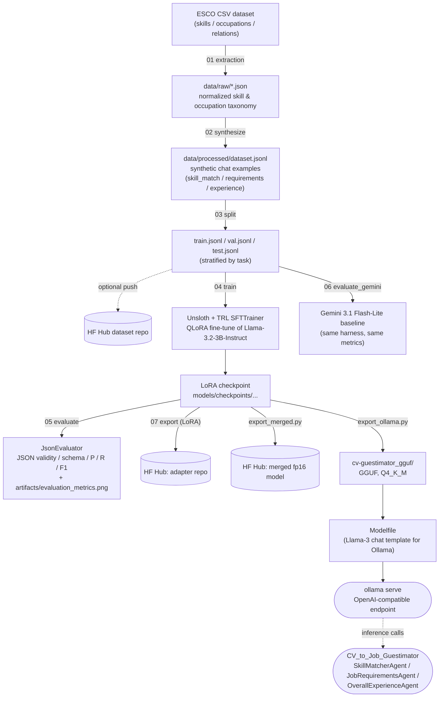

# FT_MODEL2

Fine-tuning pipeline that turns **Llama-3.2-3B-Instruct** into a small,
locally-servable JSON-in/JSON-out model for CV ⇄ job-description matching.
It is the training/eval half of a two-repo system — the model produced here
is the one served to, and consumed by, **[CV_to_Job_Guestimator](#relationship-to-cv_to_job_guestimator)**.

Everything in this repo — the synthetic data generator, the system prompts,
the Pydantic schemas, the chat templating — is built to mirror that consumer
project byte-for-byte, so a model that scores well here behaves identically
once deployed behind it.

## What this project is about

`CV_to_Job_Guestimator` runs a small pipeline of LLM "agents" that take a
candidate's CV and a job description and estimate how well they match. Three
of those agents need structured JSON output on every call:

| Agent (consumer side)     | Task here      | Job                                                                 |
|----------------------------|-----------------|----------------------------------------------------------------------|
| `SkillMatcherAgent`        | `skill_match`   | For each numbered job requirement, decide `matched: true/false` against a CV |
| `JobRequirementsAgent`     | `requirements`  | Extract atomic technical/operational skills from a job description   |
| `OverallExperienceAgent`   | `experience`    | Extract candidate work history and classify each role's relevance to the target job |

Rather than pay per-token API costs (or depend on an external provider) for
three high-volume, narrowly-scoped extraction tasks, this project **fine-tunes
a 3B model to do all three**, then exports it in a form that can be served
locally (via Ollama) at a fraction of the cost and latency of a general-purpose
LLM API — while matching or approaching frontier-model quality on this
specific job.

This repo owns the full lifecycle for that model: synthetic data generation,
LoRA fine-tuning, evaluation (including a hosted-model baseline for
comparison), and export to every format the consumer project needs.

## Relationship to CV_to_Job_Guestimator

The two repos are tightly coupled by design, not by accident:

- **Prompts are copy-pasted, not reinvented.** The three system prompts in
  [`src/pipeline/synthesize.py`](src/pipeline/synthesize.py) are verbatim
  copies of `CV_to_Job_Guestimator`'s `src/prompts/templates.py`. Training
  examples are built with the exact system/user message shapes the consumer's
  agents send at inference time (e.g. the skill-matcher's
  `JOB REQUIREMENTS:\n<json>\n\nCANDIDATE CV:\n<text>` framing).
- **Output schemas are mirrored.** [`src/core/schema.py`](src/core/schema.py)
  duplicates the consumer's `src/schemas/requirements.py` /
  `experience.py` Pydantic models, so evaluation here enforces exactly what
  `instructor`/the serving stack will enforce in production.
- **Synthetic CVs match the consumer's PII-redaction contract.** The consumer
  redacts PII from CVs *before* any LLM call, replacing spans with `[KIND]`
  placeholders (`[PERSON_NAME]`, `[STREET_ADDRESS]`, …). Every synthetic CV
  generated here is rendered the same way, so the model never trains on — or
  learns to expect — raw PII.
- **Training targets Ollama's serving path.** Prompts are tokenized with the
  model's own chat template (`apply_chat_template`), and the exported
  [`Modelfile`](cv-guestimator_gguf/Modelfile) reproduces Llama 3's official
  chat template for Ollama, so what the model sees during training is exactly
  what it sees when `CV_to_Job_Guestimator` calls it through Ollama's
  OpenAI-compatible endpoint.
- **The Gemini baseline (stage 06)** exists to give `CV_to_Job_Guestimator`'s
  maintainers a cost/quality reference point: "how much quality would we give
  up (or gain) by routing these three agents to the fine-tuned local model
  instead of a hosted frontier model?"

In short: this repo produces the model artifact; `CV_to_Job_Guestimator` is
the only intended consumer of that artifact, and every design decision here
(prompt text, JSON shape, PII format, chat template) is dictated by that
consumer's contract.

## Architecture



## The pipeline, stage by stage

Orchestrated by [`main.py`](main.py): `python main.py <stage>` runs one
numbered stage, `python main.py all` (the default) runs them in order.

| Stage | Module | Purpose |
|-------|--------|---------|
| `01` | [`src/pipeline/extraction.py`](src/pipeline/extraction.py) | Parses the raw ESCO v1.2.1 CSV export (skills, occupations, occupation↔skill relations) into two normalized JSON files (`data/raw/esco_skills.json`, `esco_occupations.json`). |
| `02` | [`src/pipeline/synthesize.py`](src/pipeline/synthesize.py) | Generates the synthetic training set. Picks an ESCO occupation, pulls its associated skills, and procedurally writes a realistic CV and/or job ad around them, then builds a chat example (`system` / `user` / `assistant`) for one of the three agent tasks. Ground truth is derived from the generation plan itself (never re-parsed from the rendered text), so labels are exact. ~50% `skill_match`, ~25% `requirements`, ~25% `experience` by default (3000 examples). |
| `03` | [`src/pipeline/split.py`](src/pipeline/split.py) | Stratified train/val/test split (80/10/10 by default) that preserves the task mix in each split. Writes local JSONL files and optionally pushes a `DatasetDict` to the Hugging Face Hub if `HF_TOKEN` is set. |
| `04` | [`src/pipeline/train.py`](src/pipeline/train.py) | Loads the base model via **Unsloth** (`FastLanguageModel`, 4-bit QLoRA), applies a LoRA adapter (r=16, α=32, dropout 0.05, targeting all attention + MLP projections), tokenizes examples with the model's own chat template, masks loss to the assistant JSON only (`-100` over the prompt), and trains with TRL's `SFTTrainer`. Logs to Weights & Biases if `WANDB_API_KEY` is set. |
| `05` | [`src/pipeline/evaluate.py`](src/pipeline/evaluate.py) | Runs the fine-tuned checkpoint over the held-out test set through [`src/pipeline/inference.py`](src/pipeline/inference.py)'s `ModelRunner`, and scores each generation per task: JSON validity, Pydantic schema compliance, precision/recall/F1, plus task-specific metrics (decision accuracy for `skill_match`; title/years/relevance accuracy for `experience`). Produces a grouped bar chart at `artifacts/evaluation_metrics.png`. |
| `06` | [`src/pipeline/evaluate_gemini.py`](src/pipeline/evaluate_gemini.py) | Re-runs the exact same evaluation harness against the **Gemini 3.1 Flash-Lite** API (schema-constrained via `response_schema`) as an external quality/cost baseline, subclassing `JsonEvaluator` and swapping in a `GeminiRunner`. Requires `GEMINI_API_KEY`. |
| `07` | [`src/pipeline/export.py`](src/pipeline/export.py) | Pushes the trained **LoRA adapter** (not merged) to the Hugging Face Hub, for lightweight distribution/versioning of just the fine-tuned deltas. |

Two more export paths exist as standalone scripts (not wired into
`main.py`'s numbered stages, run directly):

- [`export_merged.py`](export_merged.py) — merges the LoRA adapter into the
  base model in fp16 and pushes the full merged model to the Hub.
- [`export_ollama.py`](export_ollama.py) — merges and quantizes to **GGUF**
  (Q4_K_M) via Unsloth's `save_pretrained_gguf`, for local serving through
  Ollama. Paired with a hand-written [`Modelfile`](cv-guestimator_gguf/Modelfile)
  that reproduces Llama 3's chat template, stop tokens, and generation
  parameters so Ollama serves it exactly as trained.

## Repository layout

```
main.py                        # stage orchestrator (python main.py [01-07|all])
src/
  core/
    config.py                  # paths + training hyperparameters (dataclasses)
    schema.py                  # Pydantic schemas mirrored from CV_to_Job_Guestimator
  pipeline/
    extraction.py               # 01 — ESCO CSV -> JSON
    synthesize.py                # 02 — synthetic dataset generator + system prompts
    split.py                     # 03 — stratified train/val/test split (+ HF push)
    train.py                     # 04 — Unsloth/TRL QLoRA fine-tuning
    evaluate.py                  # 05 — local model evaluation harness + charts
    evaluate_gemini.py           # 06 — Gemini baseline using the same harness
    inference.py                 # ModelRunner + ResponseParser, shared by eval/inference
    export.py                    # 07 — push LoRA adapter to HF Hub
    export_merged.py             # merge + push fp16 model to HF Hub
  utils/
    parser.py                    # CSV/JSON parsing helpers, schema validation
    utils.py                     # small IO/seed/timing helpers
export_ollama.py                # merge + GGUF export for Ollama
data/
  raw/                           # normalized ESCO skills/occupations JSON
  processed/                     # synthetic dataset + train/val/test splits
cv-guestimator-adapter/          # exported LoRA adapter (HF format)
cv-guestimator/                  # exported merged fp16 model (HF format)
cv-guestimator_gguf/             # GGUF export + Ollama Modelfile
artifacts/                       # evaluation charts
```

`data/`, `cv-guestimator*/`, `artifacts/`, `models/`, and `wandb/` are
git-ignored (see [`.gitignore`](.gitignore)) — they're generated by running
the pipeline, not checked in.

## Tech stack

- **[Unsloth](https://github.com/unslothai/unsloth)** — fast, memory-efficient 4-bit QLoRA fine-tuning of Llama-3.2-3B-Instruct.
- **TRL (`SFTTrainer`) + PEFT** — the underlying supervised fine-tuning and LoRA implementation.
- **Hugging Face `datasets`/`transformers`/`huggingface_hub`** — data loading, tokenization, chat templating, and model/dataset hosting.
- **Pydantic** — schema validation shared with the consumer project.
- **`google-genai`** — Gemini API client for the stage-06 baseline.
- **Weights & Biases** — optional training run tracking.
- **`uv`** — dependency/environment management (`pyproject.toml` + `uv.lock`).
- **Ollama** — local serving target for the GGUF export.

## Running the pipeline

```bash
# Full pipeline, stages 01 → 07
python main.py all

# A single stage
python main.py 04          # just fine-tuning
python main.py 05          # just local evaluation
```

Environment variables (`.env`, not committed):

| Variable | Used by | Purpose |
|---|---|---|
| `HF_TOKEN` | `split.py`, `train.py`, `export.py`, `export_merged.py` | Push datasets/models/adapters to the Hugging Face Hub |
| `HF_DATASET_REPO` | `split.py` | Target dataset repo id (defaults to `Realist2026/cv-jd-semantic-splits`) |
| `WANDB_API_KEY` | `train.py` | Enable W&B run logging |
| `GEMINI_API_KEY` | `evaluate_gemini.py` | Auth for the Gemini baseline evaluation |

Key hyperparameters live in [`src/core/config.py`](src/core/config.py)
(`PathsConfig`, `TrainingConfig`) rather than being scattered across scripts.
